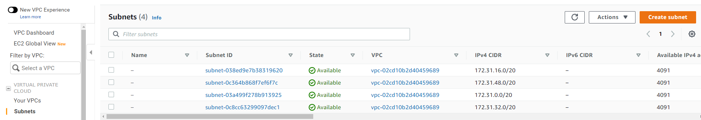

# AWS VPC Networking Lab: Creating a Routable Network

## 📖 Project Story

### The Problem 🤔
Brock, a startup owner, was frustrated with his AWS VPC setup. Despite his efforts to configure networking resources, he couldn't establish basic internet connectivity from within his VPC. His simple request was clear: "All I need to do is ping!" but his VPC was isolated from the internet, preventing any external communication.

### The Solution 💡
As a Cloud Support Engineer, I approached this systematically by building a complete VPC infrastructure from the ground up. Following AWS best practices, I created a properly configured network with all necessary components working together harmoniously.

### The Result ✅
The solution was successful! The EC2 instance within the VPC can now communicate with the internet, and Brock can finally ping external services. The infrastructure is not only functional but also follows security best practices with properly configured security groups and NACLs.

## 🏗️ Architecture Diagram

```mermaid
graph TB
    %% Define Custom Styles for AWS-like Appearance
    classDef internetStyle fill:#e6f3ff,stroke:#0078d4,stroke-width:3px,color:#000
    classDef vpcStyle fill:#fff4e6,stroke:#ff9900,stroke-width:4px,color:#000
    classDef subnetStyle fill:#e6f7ff,stroke:#1890ff,stroke-width:2px,color:#000
    classDef computeStyle fill:#f6ffed,stroke:#52c41a,stroke-width:2px,color:#000
    classDef networkStyle fill:#f0f5ff,stroke:#2f54eb,stroke-width:2px,color:#000
    classDef securityStyle fill:#fff1f0,stroke:#f5222d,stroke-width:2px,color:#000

    %% Define Nodes with Emojis and Descriptions
    Internet["🌐 Internet"]
    IGW["🌉 Internet Gateway<br/><b>(IGW test VPC)</b>"]
    
    subgraph VPC["📦 VPC: Test VPC (192.168.0.0/18)"]
        direction TB
        
        subgraph Subnet["📍 Public Subnet (192.168.0.0/22)"]
            EC2["🖥️ EC2 Instance<br/><b>(Test Lab)</b><br/>t3.micro"]
            SG["🔒 Security Group<br/><b>(public security group)</b>"]
        end
        
        RT["🛣️ Route Table<br/><b>(Public route table)</b>"]
        NACL["🚦 Network ACL<br/><b>(Public Subnet NACL)</b>"]
    end

    %% Define Connections and Traffic Flow
    Internet -- "📥 Inbound / 📤 Outbound" --> IGW
    IGW -- "Routes Traffic" --> RT
    RT -- "🔗 Route: 0.0.0.0/0 → IGW" --> IGW
    RT -- "🔗 Associated with" --> Subnet
    Subnet -- "🛡️ Protected by" --> NACL
    EC2 -- "🔗 Attached to" --> SG
    EC2 -- "🔗 Default Route: 192.168.0.0/18 → local" --> RT

    %% Apply Styles to Nodes
    class Internet internetStyle
    class IGW networkStyle
    class VPC vpcStyle
    class Subnet subnetStyle
    class EC2 computeStyle
    class SG securityStyle
    class RT networkStyle
    class NACL securityStyle
```



## 🛠️ Implementation Details

### 1. VPC Creation
- **Name**: Test VPC
- **IPv4 CIDR block**: 192.168.0.0/18
- **State**: Available


### 2. Subnet Creation
- **VPC ID**: Test VPC
- **Subnet Name**: Public Subnet
- **IPv4 CIDR block**: 192.168.0.0/22


### 3. Route Table Configuration
- **Name**: Public route table
- **VPC**: Test VPC
- **Routes**:
  - Destination: 192.168.0.0/18, Target: local
  - Destination: 0.0.0.0/0, Target: igw-070bd47bf43135aec (IGW test VPC)


### 4. Internet Gateway Setup
- **Name tag**: IGW test VPC
- **State**: Attached to VPC


### 5. Security Group Setup
- **Security group name**: public security group
- **Description**: allow public access
- **VPC**: Test VPC
- **Inbound Rules**: Allow SSH, HTTP, HTTPS traffic
- **Outbound Rules**: Allow all traffic


### 6. EC2 Instance Launch
- **Name**: Test Lab
- **Instance ID**: i-002b8401489bb2d43
- **Instance Type**: t3.micro
- **Public IPv4 Address**: 54.213.249.199
- **Subnet**: Public Subnet
- **Security Group**: public security group


## 🔍 Testing Connectivity

After launching the EC2 instance, I connected via SSH and tested internet connectivity:
```bash
ping google.com
